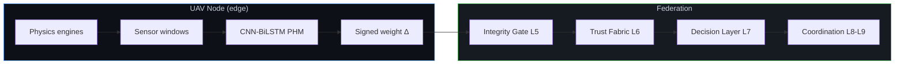

# PHI-SWARM

**Physics-Hybrid Integrity Framework for Secure Autonomous UAV Swarms**

Built by [Mohammed Bello Sani](https://smbello.vercel.app) at [Penelope Inc. — PHI Lab](https://penelope-inc.vercel.app).
[](LICENSE)
[](https://www.python.org/downloads/)
[](docs/reproducibility.md)
[](docs/limits.md)

> ZeroTwin = the federated physics-informed **health twin** (params only, signed updates).  
> PHI-SWARM = the trust · decision · safety · coordination stack on top (software L0–L9).  
> **L10 HIL and L11 flight are deliberately out of scope.**



### What moves (and what never leaves the node)

| Layer | What travels | What stays local |
|-------|--------------|------------------|
| L0–L1 | — | Raw vibration / thermal / voltage / acoustic windows |
| L2–L3 | Ed25519-signed weight deltas only | Model gradients, raw telemetry |
| L5–L6 | Integrity scores + trust vectors | Private audit logs |
| L7–L9 | Safety directives & coordination messages | Flight control loops |

---

## Why this exists

Traditional digital twins push high-rate sensor streams to a central host.  
In multi-operator, bandwidth-limited, or sovereignty-constrained settings that design collapses.

PHI-SWARM answers with three hard constraints:

1. **Zero leakage of raw telemetry** — only signed parameter updates cross the network.
2. **Physics-grounded Non-IID data** — every node’s degradation is generated by deterministic engines (rotor imbalance, ESC thermal runaway, BPFO-style bearing, LiPo sag).
3. **Measurable resilience** — link-loss, adversarial injection, and seed sweeps are first-class experiments, not afterthoughts.

We do **not** claim to have solved operational secure autonomous swarm intelligence.  
We ship a progressive, fully reproducible software ladder toward that goal.

---

## Quick start (reproducible in minutes)

```bash
git clone https://github.com/Sm-bello/PHI-SWARM.git
cd PHI-SWARM
python -m venv .venv && source .venv/bin/activate   # Windows: .venv\Scripts\activate
pip install -r requirements.txt

# Deterministic L5–L9 gate validation
python scripts/validate_l5_l9.py

# 2-minute continuous PHI-SWARM simulation
python scripts/run_phi_swarm.py --minutes 2 --round-interval 2

# Full validation suite
python scripts/run_full_validation.py
```

All telemetry is generated on the fly by the physics engines.  
**No external dataset download is required.**

Optional static export (not needed to run experiments):

```bash
python scripts/generate_dataset.py
```

---

## Implemented ladder (software)

```
L0  Physics engines               ✓
L1  Local PHM (CNN-BiLSTM)        ✓
L2  Federated aggregation         ✓
L3  Crypto integrity (Ed25519)    ✓
L4  Link-loss simulation          ✓
L5  Physics-aware integrity gate  ✓
L6  Trust fabric                  ✓
L7  Decision layer                ✓
L8–L9 Coordination / directives   ✓
L10 HIL                           ✗  (out of scope)
L11 Flight                        ✗  (out of scope)
```

---

## Key scripts

| Script | Purpose |
|--------|---------|
| `scripts/validate_l5_l9.py` | Deterministic gate & trust checks |
| `scripts/run_phi_swarm.py` | Continuous multi-node simulation + audit trail |
| `scripts/run_full_validation.py` | Complete validation suite |
| `scripts/run_integrity_experiment.py` | Core integrity experiment |
| `scripts/run_seed_sweep.py` | Accuracy vs seed reproducibility |
| `scripts/run_link_loss_sweep.py` | Resilience under intermittent connectivity |
| `scripts/run_adversarial_validation.py` | Adversarial injection checks |
| `scripts/run_autonomy_validation.py` | Autonomy / decision checks |
| `scripts/export_paper_artifacts.py` | CSVs / figures for publication |
| `scripts/build_jais_evidence.py` | Evidence tables for paper |
| `scripts/verify_audit_trail.py` | Cryptographic audit verification |
| `scripts/benchmark_edge.py` | Edge timing / size characterization |
| `scripts/generate_dataset.py` | Optional static NPZ export |
| `scripts/figure_trust_convergence.py` | Trust convergence figure |

Live dashboard (wired to the full engine):

```bash
python -m zerotwin.observability.dashboard_live
```

---

## Documentation map

| Document | Content |
|----------|---------|
| [`docs/PHI_SWARM.md`](docs/PHI_SWARM.md) | Full L0–L11 framework definition |
| [`docs/ARCHITECTURE.md`](docs/ARCHITECTURE.md) | ZeroTwin technical pillars |
| [`docs/VISION.md`](docs/VISION.md) | Today vs horizon |
| [`docs/PAPER_FRAMING.md`](docs/PAPER_FRAMING.md) | Recommended claim language |
| [`docs/RUN_SEQUENCE.md`](docs/RUN_SEQUENCE.md) | Verification gates |
| [`docs/HARDWARE_ADAPTER.md`](docs/HARDWARE_ADAPTER.md) | Future real-node contract |
| [`docs/threat_model.md`](docs/threat_model.md) | T1–T7 + out-of-scope |
| [`docs/reproducibility.md`](docs/reproducibility.md) | Exact commands, seeds, artifacts |
| [`docs/limits.md`](docs/limits.md) | Software-only claim boundaries |

---

## Package layout

```
PHI-SWARM/
├── README.md
├── LICENSE
├── CITATION.cff
├── requirements.txt
├── .gitignore
├── docs/
├── scripts/
├── zerotwin/          # installable package (physics, models, federated, integrity, ...)
├── artifacts/         # small example outputs only
├── configs/           # optional experiment configs
└── tests/
```

Runtime outputs land in `zerotwin/results/` (gitignored). Regenerate with the scripts above.

---

## Citation

```bibtex
@software{phiswarm2026,
  title  = {PHI-SWARM: Physics-Hybrid Integrity Framework for Secure Autonomous UAV Swarms},
  author = {Bello, S. M.},
  year   = {2026},
  url    = {https://github.com/Sm-bello/PHI-SWARM},
  note   = {Software L0--L9 simulation framework}
}
```

cff-version: 1.2.0
message: "If you use this software, please cite it as below."
title: "PHI-SWARM: Physics-Hybrid Integrity Framework for Secure Autonomous UAV Swarms"
authors:
  - family-names: "Bello"
    given-names: "Mohammed Sani"
    affiliation: "Penelope Inc. (PHI Lab)"
    website: "https://smbello.vercel.app"
version: "1.0.0"
date-released: "2026-09-01"
repository-code: "https://github.com/Sm-bello/PHI-SWARM"
url: "https://penelope-inc.vercel.app"
license: MIT
type: software
keywords:
  - federated learning
  - prognostics and health management
  - UAV swarm
  - digital twin
  - physics-informed machine learning
  - integrity
  - adversarial robustness
---
---

## Author & Lab

[#author--lab](#author--lab)

**Mohammed Bello Sani** — Founder, CEO & Chief Technologist
Aerospace Engineering (AFIT Kaduna) · Incoming M.Sc., Smart Aviation Center, Beihang University

- Portfolio: [smbello.vercel.app](https://smbello.vercel.app)
- Lab: [Penelope Inc. — PHI Lab](https://penelope-inc.vercel.app)
- GitHub: [@Sm-bello](https://github.com/Sm-bello)

PHI-SWARM is developed under **Penelope Inc.'s PHI Lab**, alongside the related
PHI-Twin, PHI-Chain, and PHI-Drone suites.

---

## License

- **Code**: MIT  
- **Frozen results / figures / synthetic exports** (Zenodo): CC-BY-4.0 recommended

---

## Status

This repository is the public source of truth for the software framework.  
Frozen evaluation artifacts for a paper release should be archived on Zenodo with a DOI and linked here after the first tagged release (`v1.0.0`).
