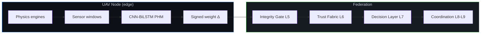

# PHI-SWARM Package

## 1. Discoverable GitHub title + repo naming

### Recommended repository name
````text
PHI-SWARM
````

### Full GitHub title (appears in search / social previews)
````text
PHI-SWARM: Physics-Hybrid Integrity Framework for Secure Autonomous UAV Swarms
````

### Short description (GitHub "About" field — keep ≤ 350 chars)
````text
Software L0–L9 framework for integrity-gated federated PHM on multi-UAV swarms. Physics-twin data stays local; only signed weight deltas are exchanged. Reproducible validation suite, threat model, and audit trail. No flight claims.
````

### Why this works for discovery
- "PHI-SWARM" is unique and memorable.
- Keywords that researchers actually search: federated learning, PHM, UAV swarm, integrity, digital twin, physics-informed, adversarial resilience.
- Explicitly signals "software simulation only" so you avoid over-claiming.

### Suggested topics/tags on the repo
````text
uav, swarm, federated-learning, phm, digital-twin, integrity, physics-informed, adversarial-robustness, edge-ai, reproducibility
````

---

## 2. Animated README.md (drop in as root README.md)

````markdown
# PHI-SWARM

**Physics-Hybrid Integrity Framework for Secure Autonomous UAV Swarms**

[](LICENSE)
[](https://www.python.org/downloads/)
[](docs/reproducibility.md)
[](docs/limits.md)

> ZeroTwin = the federated physics-informed **health twin** (params only, signed updates).
> PHI-SWARM = the trust · decision · safety · coordination stack on top (software L0–L9).
> **L10 HIL and L11 flight are deliberately out of scope.**



### What moves (and what never leaves the node)

| Layer | What travels                              | What stays local                                     |
| ----- | ----------------------------------------- | ---------------------------------------------------- |
| L0–L1 | —                                         | Raw vibration / thermal / voltage / acoustic windows |
| L2–L3 | Ed25519-signed weight deltas only         | Model gradients, raw telemetry                       |
| L5–L6 | Integrity scores + trust vectors          | Private audit logs                                   |
| L7–L9 | Safety directives & coordination messages | Flight control loops                                 |

---

## Why this exists

Traditional digital twins push high-rate sensor streams to a central host.
In multi-operator, bandwidth-limited, or sovereignty-constrained settings that design collapses.

PHI-SWARM answers with three hard constraints:

1. **Zero leakage of raw telemetry** — only signed parameter updates cross the network.
2. **Physics-grounded Non-IID data** — every node's degradation is generated by deterministic engines (rotor imbalance, ESC thermal runaway, BPFO-style bearing, LiPo sag).
3. **Measurable resilience** — link-loss, adversarial injection, and seed sweeps are first-class experiments, not afterthoughts.

We do **not** claim to have solved operational secure autonomous swarm intelligence.
We ship a progressive, fully reproducible software ladder toward that goal.

---

## Quick start (reproducible in < 5 min)

```bash
git clone https://github.com/<your-org>/PHI-SWARM.git
cd PHI-SWARM
python -m venv .venv && source .venv/bin/activate # Windows: .venv\Scripts\activate
pip install -r requirements.txt

# Deterministic L5–L9 gate validation
python scripts/validate_l5_l9.py

# 2-minute continuous PHI-SWARM simulation
python scripts/run_phi_swarm.py --minutes 2 --round-interval 2

# Full validation suite (integrity + seed + link-loss + edge + live)
python scripts/run_full_validation.py
```

All telemetry is generated on the fly by the physics engines.
**No external dataset download is required.**

---

## Implemented ladder (software)

````
L0 Physics engines ✓
L1 Local PHM (CNN-BiLSTM) ✓
L2 Federated aggregation ✓
L3 Crypto integrity (Ed25519) ✓
L4 Link-loss simulation ✓
L5 Physics-aware integrity gate ✓
L6 Trust fabric ✓
L7 Decision layer ✓
L8–L9 Coordination / directives ✓
L10 HIL ✗ (explicitly out of scope)
L11 Flight ✗ (explicitly out of scope)
````

---

## Key scripts

| Script                              | Purpose                                          |
| ------------------------------------ | ------------------------------------------------ |
| `scripts/validate_l5_l9.py`         | Deterministic gate & trust checks                |
| `scripts/run_phi_swarm.py`          | Continuous multi-node simulation + audit trail   |
| `scripts/run_full_validation.py`    | Complete paper validation suite                  |
| `scripts/run_seed_sweep.py`         | Accuracy vs seed reproducibility                 |
| `scripts/run_link_loss_sweep.py`    | Resilience under intermittent connectivity       |
| `scripts/export_paper_artifacts.py` | CSVs / figures for publication                   |
| `scripts/verify_audit_trail.py`     | Cryptographic audit verification                 |
| `scripts/generate_dataset.py`       | Optional static NPZ export (not required to run) |

Live dashboard (wired to the full engine):
```bash
python -m zerotwin.observability.dashboard_live
```

---

## Documentation map

| Document                                             | Content                                   |
| ----------------------------------------------------- | ------------------------------------------ |
| [`docs/PHI_SWARM.md`](docs/PHI_SWARM.md)             | Full L0–L11 framework definition          |
| [`docs/ARCHITECTURE.md`](docs/ARCHITECTURE.md)       | ZeroTwin technical pillars                |
| [`docs/threat_model.md`](docs/threat_model.md)       | T1–T7 + explicit out-of-scope             |
| [`docs/reproducibility.md`](docs/reproducibility.md) | Exact commands, seeds, expected artifacts |
| [`docs/limits.md`](docs/limits.md)                   | Software-only claim boundaries            |
| [`docs/PAPER_FRAMING.md`](docs/PAPER_FRAMING.md)     | Recommended claim language                |

---

## Citation

When the Zenodo DOI is live, update this block. Until then:

```bibtex
@software{phiswarm2026,
title = {PHI-SWARM: Physics-Hybrid Integrity Framework for Secure Autonomous UAV Swarms},
author = {<Your Name>},
year = {2026},
url = {https://github.com/<your-org>/PHI-SWARM},
note = {Software L0--L9 simulation framework}
}
```

See also `CITATION.cff`.

---

## License

- **Code**: MIT
- **Results / figures / synthetic data** (when published on Zenodo): CC-BY-4.0

---

## Status

This repository is the **public, clean source of truth**.
Frozen evaluation outputs that accompany the paper live on Zenodo (link will appear here after the first tagged release).
````

---

## 3. Folder / file list for a clean, reproducible GitHub upload

### INCLUDE (public tree)

````
PHI-SWARM/
├── README.md ← the animated one above
├── LICENSE ← MIT (or Apache-2.0)
├── CITATION.cff
├── requirements.txt
├── pyproject.toml ← optional but recommended
├── .gitignore
│
├── docs/
│ ├── PHI_SWARM.md
│ ├── ARCHITECTURE.md
│ ├── VISION.md
│ ├── PAPER_FRAMING.md
│ ├── RUN_SEQUENCE.md
│ ├── HARDWARE_ADAPTER.md
│ ├── threat_model.md ← create if missing (T1–T7)
│ ├── reproducibility.md ← exact seeds + expected outputs
│ └── limits.md ← software-only claims
│
├── zerotwin/ ← the installable package
│ ├── __init__.py
│ ├── models/
│ ├── physics/
│ ├── federated/
│ ├── integrity/
│ ├── crypto/
│ ├── trust/
│ ├── autonomy/
│ ├── audit/
│ ├── simulation/
│ ├── observability/ ← keep the dashboard
│ └── testbed/ ← if used by validation scripts
│
├── scripts/
│ ├── validate_l5_l9.py
│ ├── run_phi_swarm.py
│ ├── run_full_validation.py
│ ├── run_integrity_experiment.py
│ ├── run_seed_sweep.py
│ ├── run_link_loss_sweep.py
│ ├── run_adversarial_validation.py
│ ├── run_autonomy_validation.py
│ ├── export_paper_artifacts.py
│ ├── build_jais_evidence.py
│ ├── verify_audit_trail.py
│ ├── benchmark_edge.py
│ ├── generate_dataset.py
│ ├── figure_trust_convergence.py
│ └── ... (any other public experiment scripts)
│
├── configs/ ← if present
│ └── default_experiment.yaml
│
├── tests/ ← thin smoke tests only
│ └── test_gate_smoke.py
│
└── artifacts/ ← **samples only**
├── README.md ← "Full results on Zenodo; regenerate with scripts"
└── example_phi_swarm_summary.json ← one small example is fine
````
